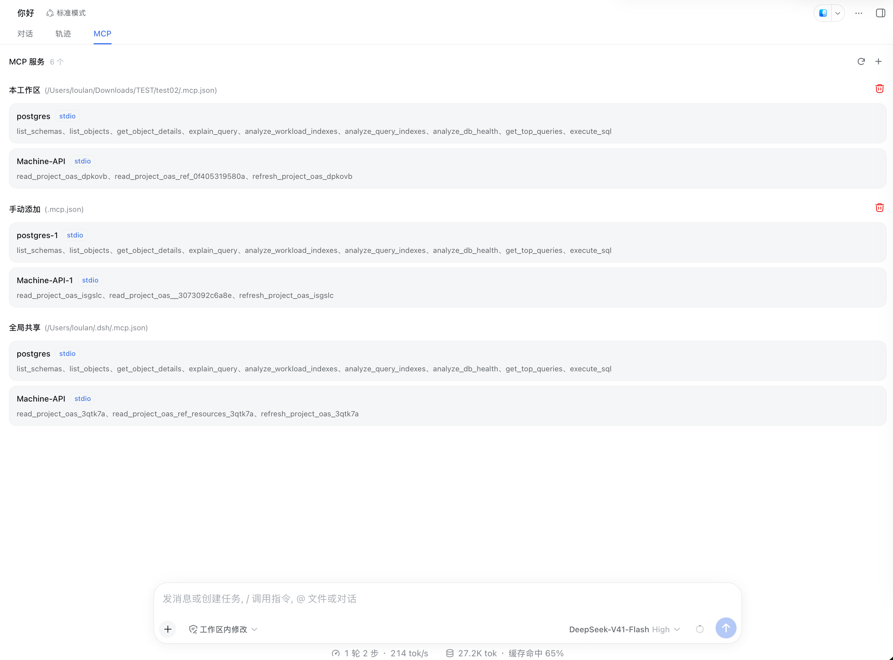

# dsh-loulan-mcp

> **把项目里的 `.mcp.json` 变成 DSH 会话中开箱即用的 MCP 能力，并给出一页看得见的清单。**

`dsh-loulan-mcp` 是 [DeepSeek Harness](https://github.com/deepseek-ai/deepseek-harness)（DSH）的 MCP 挂载插件：

- **DSH 启动时**：自动挂载 `~/.dsh/.mcp.json`，全局共享，所有 agent 可用；
- **agent 创建/恢复时**：自动挂载该会话工作区的 `.mcp.json`，只属于这个会话，agent 销毁即卸载；
- **会话视图区**：新增与「对话」「轨迹」同级的 **「MCP」标签页**，可查看当前会话加载了什么，并支持刷新、添加、卸载。

整条链路**不写会话日志、不进入模型上下文**——模型只知道工具可用，不知道插件存在。

## 30 秒速览

| | |
|---|---|
| **零配置** | 把 `.mcp.json` 放进工作区根目录即可：不用写插件配置、不用审批、不用重启 |
| **不打架** | 同一工作区并发多个会话时各自挂载、各带唯一后缀（如 `postgres_9f2c1a7b3d5e`），同名服务互不冲突 |
| **看得见** | 「MCP」标签页按「本工作区 / 手动添加 / 全局共享」三组列出服务名、传输方式与工具名 |
| **以磁盘为准** | 刷新（或重新打开标签页）时对照 `.mcp.json`：内容变了增量重挂、文件没了就卸载、没变则一个都不动 |
| **静默** | 挂载与卸载全程不产生会话事件、不占用模型上下文、不打断对话 |

**兼容性**：标签页与 HTTP 端点只在提供 `webServer` 的 profile（如 Web）生效，其它 profile 照常挂载、只是没有界面。依赖 `@deepseek-ai/dsh-mcp-client`，**其版本必须与你的 DSH 运行时一致**（详见[常见问题](#8-常见问题)）。

## 目录

- [1. 它解决什么问题](#1-它解决什么问题)
- [2. 核心能力](#2-核心能力)
- [3. 安装](#3-安装)
- [4. 使用](#4-使用)
- [5. 配置](#5-配置)
- [6. 工作原理](#6-工作原理)
- [7. 约束与已知限制](#7-约束与已知限制)
- [8. 常见问题](#8-常见问题)
- [9. 开发与发布](#9-开发与发布)
- [10. 设计记录](#10-设计记录)

---

## 1. 它解决什么问题

`.mcp.json` 是 MCP 生态里的事实约定（Claude Code、Cursor 等都在用），它最大的价值是**跟着项目走**：写进仓库、团队共享、换台机器 clone 下来就有。但它也带来三个现实问题：

| 问题 | 本插件的做法 |
|---|---|
| 每个项目都要手工把服务抄进一份全局配置，抄漏了就「工具莫名不可用」 | 直接读工作区根的 `.mcp.json`，**文件在就挂载**，不需要任何开关 |
| 同一项目开两个会话，同名服务互相抢占/覆盖 | 工作区挂载按 agent 生成唯一后缀，**每个会话独立一份**，agent 销毁自动卸载 |
| 挂载完是黑盒：不知道到底加载了什么、工具名是什么 | 「MCP」标签页列出三组来源的**服务名、传输方式与完整工具名**，可刷新/添加/卸载 |

同时它刻意做了一个「反直觉但重要」的选择：**所有展示信息都不进入模型上下文**。挂载清单只走插件的内存注册表与 HTTP 端点，模型看不到、会话日志里也没有——不会污染对话，也不会为一份清单多花 token。

## 2. 核心能力

| 能力 | 说明 |
|---|---|
| 双来源、不同策略 | `.dsh` 根（全局共享，启动时挂载）与工作区（会话私有，agent 创建时挂载） |
| 两种传输 | `stdio`（本地子进程）与 `streamable-http`（远程服务） |
| 会话级隔离 | 工作区/手动挂载带唯一后缀：`<base>_<agentToken>`、`<base>_<agentToken>u` |
| 自动挂载、无需审批 | 工作区命中 `.mcp.json` 即挂载；agent 销毁随作用域卸载 |
| 「MCP」标签页 | 三组清单 + 服务名 + 传输 pill + 工具名（可展开） |
| 刷新 | 全局增量重挂 + 本会话重挂，**未变更的部分不重挂**（不重启子进程） |
| 添加 | 在标签页直接上传一个 `.mcp.json`，挂到当前会话 |
| 卸载 | 分组级卸载（全局共享刻意不提供入口，服务端同样拒绝） |
| 空闲保护 | 有会话正在运行时，写操作返回 `409`，不打断对话 |
| 零日志污染 | 不追加任何会话事件、不进模型上下文、不唤醒模型 |

## 3. 安装

### 3.1 从 profile 安装（包发布后）

```sh
dsh plugin --profile web add dsh-loulan-mcp
```

该命令把包装进 profile 目录；装完重启 DSH 生效。

### 3.2 从源码本地接入（当前开发方式）

前提：一份可运行的 DSH checkout（默认 `~/.dsh/deepseek-harness`）、Node ≥ 23.6。

```sh
pnpm install

# 把 harness 里的 @deepseek-ai/* 包软链进来，使源码能像 monorepo 内插件那样 import
pnpm link:dsh                                   # 读 DSH_HARNESS，缺省 ~/.dsh/deepseek-harness
pnpm link:dsh -- /path/to/deepseek-harness      # 或显式指定 harness 路径

# 以本仓库的 cordis.yml 作为 patch overlay 启动 Web UI（固定端口 13080）
pnpm dev
```

> `pnpm install` 会重建 `node_modules` 并清掉手工软链，**之后需要重跑一次 `pnpm link:dsh`**。

仓库根的 `cordis.yml` 已经把 `packages/mcp`（本插件）与 `packages/hello`（示例插件）接进 overlay，`pnpm dev` 会自动带上它。

### 3.3 确认是否生效

```sh
curl -s http://127.0.0.1:13080/dsh-loulan-mcp/mounts
```

返回 JSON（三组清单）说明 Host 半侧已就绪；打开任意会话，视图区应出现「对话 / 轨迹 / MCP」三个标签。看不到时见[常见问题](#看不到mcp标签页)。

## 4. 使用

### 4.1 写 `.mcp.json`

放在**工作区根目录**（或 `~/.dsh/` 下作为全局共享）：

```json
{
  "mcpServers": {
    "memory": {
      "command": "npx",
      "args": ["-y", "@modelcontextprotocol/server-memory"]
    },
    "postgres": {
      "command": "uvx",
      "args": ["--with", "mcp<2", "postgres-mcp", "--access-mode=restricted"],
      "env": { "DATABASE_URI": "postgresql://localhost/mydb" }
    },
    "remote-api": {
      "type": "streamable-http",
      "url": "https://example.com/mcp",
      "headers": { "Authorization": "Bearer <token>" }
    }
  }
}
```

**查找规则**：只在起始目录本身查找 `.mcp.json`（`~/.dsh` 或会话工作区），**不向上递归父目录**。

### 4.2 条目如何映射

| 条目内容 | 结果 |
|---|---|
| 含字符串 `command` | `stdio`：本进程拉起子进程；`args` / `env` / `cwd` 可选 |
| 含字符串 `url` | `streamable-http`：连接远程服务；`headers` 可选 |
| 两者都有 | 按 `command` 处理（stdio 优先） |
| 两者皆无 | 跳过该条目并打印告警 |
| `type` 字段 | **当前不参与判断**（写了不影响结果） |
| 非字符串的 `args` / `env` / `headers` 值 | 被静默丢弃 |
| `serverName` 不匹配 `[A-Za-z0-9_-]{1,32}` | 跳过该条目并打印告警 |

`stdio` 的默认工作目录：全局/工作区条目取 **`.mcp.json` 所在目录**；手动添加的条目取 **会话工作区目录**。

### 4.3 挂载时机

| 来源 | 时机 | 作用域 | 卸载 |
|---|---|---|---|
| `~/.dsh/.mcp.json` | DSH 启动时 | 全局，所有 agent 共享 | 文件消失后刷新即卸载 |
| 工作区 `.mcp.json`（`session.header.cwd`） | agent 创建/恢复时 | 仅该会话 | agent 销毁自动卸载；会话内可临时停用 |
| 标签页「添加」上传的文件 | 手动触发 | 仅该会话 | 可卸载（连上传内容一起丢弃）；进程重启即消失 |

> 工作区 `.mcp.json` 与全局根命中**同一个文件**时跳过工作区挂载，清单只出现在「全局共享」组（避免重复挂载）。

### 4.4 「MCP」标签页



- **三组固定顺序**：本工作区 → 手动添加 → 全局共享；空组不显示。
- **`⟳` 刷新**：先按磁盘现状同步全局配置，再重挂本会话；未变更的服务不动。有会话正在运行时返回 `409`（界面显示原因）。
- **`＋` 添加**：选择一个 `.mcp.json` 上传并挂到当前会话。
- **`🗑` 卸载**：仅前两组有入口，语义不同（见下表），带二次确认弹窗。
- **工具名**：默认折到 2 行，真实溢出时给「展开／收起」；服务未就绪或未暴露工具时显示「工具列表暂不可用」。

| 卸载目标 | 语义 |
|---|---|
| 本工作区 | **临时停用**：释放挂载但保留来源，刷新会重新读取 `.mcp.json` 并挂回 |
| 手动添加 | **彻底清除**：连保留的上传内容一起丢弃，刷新不会带回 |
| 全局共享 | 不提供入口，服务端亦返回 `400`；只能改文件 + 刷新（或重启）来改变 |

### 4.5 刷新到底做了什么

刷新（以及每次打开标签页拉取清单）都会先让**全局**配置与磁盘对齐：

| 全局 `.mcp.json` 的现状 | 行为 |
|---|---|
| 内容有变 | 增量重挂：新增的挂载、变更的先卸载再挂载、已删除的卸载 |
| **内容未变** | 只比对指纹，**不卸载、不重挂**（子进程不重启） |
| **文件不存在** | **卸载全部全局服务**，「全局共享」组随之消失 |
| 存在但解析失败 | 保留现有挂载并告警（避免编辑中的半截文件把服务清空） |

本会话的工作区与手动添加同时会重挂（重新读取文件 / 重挂保留的上传内容）。

## 5. 配置

| 字段 | 说明 | 默认 |
|---|---|---|
| `cwd` | `.dsh` 根目录（启动时读取全局 `.mcp.json` 的起点） | `$DSH_HOME` 或 `~/.dsh` |

**工作区部分无需任何配置**：随 agent 的 `session.header.cwd` 自动发现并挂载，也没有开关。

如需覆盖默认值，在 profile 的 `cordis.patch.yml` 中配置：

```yaml
- id: dsh-loulan-mcp
  name: dsh-loulan-mcp
  config:
    cwd: /path/to/.dsh
```

## 6. 工作原理

```
      ~/.dsh/.mcp.json                        <工作区>/.mcp.json
             │                                        │
     DSH 启动 ┘                    agent 创建 / 恢复 ┘
             │                                        │
             └───────────────────┬────────────────────┘
                                 ▼
              挂载（走 dsh-mcp-client）
              stdio 子进程 / streamable-http 连接
              serverName：postgres   ·   postgres_9f2c1a7b3d5e
                                 │
                                 ▼
              进程内注册表（按 sessionId 记录挂载句柄）
                                 │
      GET /dsh-loulan-mcp/mounts（读取前先同步全局文件现状）
                                 ▼
              「MCP」标签页：本工作区 / 手动添加 / 全局共享
```

**工具名与隔离**：mcp-client 以 `mcp__<serverName>__<工具名>` 注册工具。工作区挂载把 agent token 拼进 `serverName`（`agentToken = sha1(agentId)` 的前 12 位十六进制，如 `postgres_9f2c1a7b3d5e`），因此同一个 `postgres` 在不同会话里分别是 `mcp__postgres_9f2c…__execute_sql` 与 `mcp__postgres_4a71…__execute_sql`，互不覆盖；手动添加再多一个 `u` 后缀，避免与工作区同名服务冲突。`serverName` 超长时**截断原始名、保留后缀**，以遵守 32 位上限。

**HTTP 端点**（Host 半侧注册在 `/dsh-loulan-mcp` 前缀下）：

| 端点 | 作用 |
|---|---|
| `GET /mounts?sessionId=…` | 读取三组清单；**读取前先同步全局 `.mcp.json`**；有会话运行中时跳过同步 |
| `POST /refresh` | 全局增量重挂 + 本会话重挂（`sessionId` 可放 body 或查询串） |
| `POST /add` | 上传 `.mcp.json` 内容并挂到当前会话（上限 256 KiB） |
| `POST /unload` | 卸载本会话的一个来源分组（`workspace` / `manual`；`global` 一律 `400`） |

**空闲保护**：三个写端点在有 agent 处于 `running` 时返回 `409`；`GET` 只静默跳过同步、照常返回内存快照。

**启动失败**：单个服务映射/启动失败不影响同组其它服务；失败项不出现在清单里，但会被登记，避免后续刷新重复挂载同名服务。

## 7. 约束与已知限制

| 限制 | 说明 |
|---|---|
| **仅限 localhost** | 端点无鉴权，只按 `sec-fetch-site` 拒绝跨站浏览器请求；仅适用于本机绑定的部署，**不要把 DSH 暴露到公网** |
| 数据仅「当前运行期」 | 注册表在内存中；进程重启后重新打开会话或刷新即可重建 |
| 工作区文件**新增**不会被发现 | `workspaceFile` 在 agent 创建时确定；会话创建后再放入 `.mcp.json` 需要新开会话（**删除**则刷新即生效） |
| 手动添加的来源只有文件名 | 浏览器出于安全不提供所选文件的真实路径，分组标题里显示的只能是上传文件名 |
| 上传上限 256 KiB | 超出返回 `400`；手动添加的内容只存内存，进程重启即消失 |
| 工具调用超时固定 60 秒 | 当前实现写死，不能通过 `.mcp.json` 覆盖 |
| `serverName` 上限 32 位 | 工作区/手动挂载会截断原始名以容纳唯一后缀 |
| 全局共享不可卸载 | 服务端硬拒绝（`400`），防止误伤其它会话 |
| 解析失败保守处理 | 全局文件解析失败时保留现有挂载；只有**文件不存在**才卸载 |
| 全程静默 | 不写会话日志、不产生通知，模型不会被告知「刚刚挂了什么」 |

## 8. 常见问题

### MCP server 启动报 `ModuleNotFoundError: No module named 'mcp.server.fastmcp'`

这是 mcp 2.x 的破坏性改版导致的：某些 Python MCP server（如 `postgres-mcp`）仍使用 v1 的 `FastMCP` API，但 `uvx` 解析到了 mcp 2.x。修法是在 `uvx` 前加 `--with "mcp<2"` 锁定 v1：

```json
{
  "command": "uvx",
  "args": ["--with", "mcp<2", "postgres-mcp", "--access-mode=restricted"]
}
```

### 标签页里某个服务不见了 / 工具列表为空

- **服务不见了**：多半是启动失败（映射失败或子进程握手失败）。查 DSH 日志里 `[dsh-loulan-mcp]` 开头的告警；失败项被刻意排除在清单之外。
- **工具列表暂不可用**：服务已挂载但工具尚未枚举到（`tools` 为空），稍后刷新即可；也可能是该服务确实没有暴露工具。
- **整个「全局共享」组消失**：全局 `.mcp.json` 已不存在（预期行为）；解析失败时则会保留旧挂载。

### 看不到「MCP」标签页

1. **是不是 Web profile？** 端点与标签页由可选的 `webServer` 提供，其它 profile 只有挂载、没有界面。
2. **`lib/client.js` 存在吗？** 包声明了 `dsh.client` 就必须有构建产物，否则 Web 启动会聚合报错。先跑 `pnpm --filter dsh-loulan-mcp build`。
3. **刷新页面**：客户端是模块化加载的，改完客户端代码需重建 + 刷新页面。
4. **直接探端点**：`curl -s http://127.0.0.1:13080/dsh-loulan-mcp/mounts`；返回 404 说明插件没被挂载。
5. 该会话尚未登记时，`GET /mounts` 只返回全局分组（属正常）。

### 提示「有会话正在运行，请稍后再刷新/添加/卸载」

空闲保护：只要有 agent 处于 `running`，三个写端点一律 `409`。等当前回合结束再操作。

### 出现两份 mcp-client / 工具注册冲突

本插件依赖的 `@deepseek-ai/dsh-mcp-client` 版本必须与 DSH 运行时一致。版本错配时可能出现两份 mcp-client，导致工具注册冲突。

## 9. 开发与发布

### 目录结构

```text
packages/mcp/
├── src/
│   ├── index.ts          # 插件入口：全局挂载 + 端点注册 + 生命周期监听
│   ├── approval.ts       # agent/created 时发现并挂载工作区 .mcp.json
│   ├── mounts.ts         # 进程内运行时：会话记录 + 刷新/添加/卸载 + 全局同步
│   ├── mount.ts          # 映射并挂载 mcpServers、组装展示分组
│   ├── server-name.ts    # serverName 命名、唯一后缀、条目 → mcp-client 配置
│   ├── discover.ts       # .mcp.json 与 .dsh 根目录发现
│   ├── parse.ts          # 解析与防御式类型校验
│   ├── contract.ts       # 数据契约与路由常量（Host / 浏览器共用）
│   ├── http.ts           # HTTP 端点
│   └── client/           # 浏览器半侧：标签页、数据源、样式、词典
├── test/                 # node:test + tsx
├── example/mcp.html      # 样式试验台（设计稿，不参与发布）
└── scripts/              # 客户端打包与测试脚本
```

### 常用命令

```sh
pnpm --filter dsh-loulan-mcp test     # 单元测试（node:test + tsx）
pnpm --filter dsh-loulan-mcp build    # Host tsc + 客户端类型检查 + esbuild 打包客户端
```

### 产物与发布约定

- **`lib/` 不入库**，由构建生成；`package.json` 的 `files` 包含整个 `lib/` 与 `cordis.patch.yml`。
- `dsh.client` 声明与 `lib/client.js` **必须同时存在**：只声明不构建会让 Web 启动时报错。`prepack` 已自动触发 `build`。
- 发布：`pnpm release`（`pnpm login` + `build` + `publish`）。
- ⚠️ **删除某个 `src/` 模块后，先清理 `lib/`**：`tsc` 不会删除输出目录里的旧产物，残留模块会被一起发布。构建前 `rm -rf lib` 最省心。

### 样式与设计稿

- 样式以模板字符串内联在 `src/client/styles.ts`，由 `ensureMcpStyles()` 一次性注入 `<style data-plugin="dsh-loulan-mcp">`（等价于 harness 的样式注入机制，只是不引入 CSS Modules 管线）。
- 类名统一带 `dsh-mcp-` 前缀；颜色一律走语义 token（`--dsw-alias-*`、`--dsw-specific-tip`），因此自动跟随明暗主题。
- `example/mcp.html` 是**可交互设计稿**：与实现共用同一套类名，可切换工具条方案、服务行方案、主题、状态与容器宽度。改版式时先在这里定稿，再回写 `styles.ts` / `McpView.tsx`。

## 10. 设计记录

| 文档 | 内容 |
|---|---|
| [`docs/superpowers/specs/2026-09-17-dsh-loulan-mcp-mount-tab-design.md`](docs/superpowers/specs/2026-09-17-dsh-loulan-mcp-mount-tab-design.md) | 「MCP」标签页的完整设计：数据契约、数据通道变更（会话事件 → 内存注册表 + HTTP 端点）、打包约束，以及各次修订记录（§12 数据通道、§13 移除通知） |
| [`docs/superpowers/plans/`](docs/superpowers/plans) | 实现计划（历史记录） |
